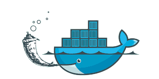
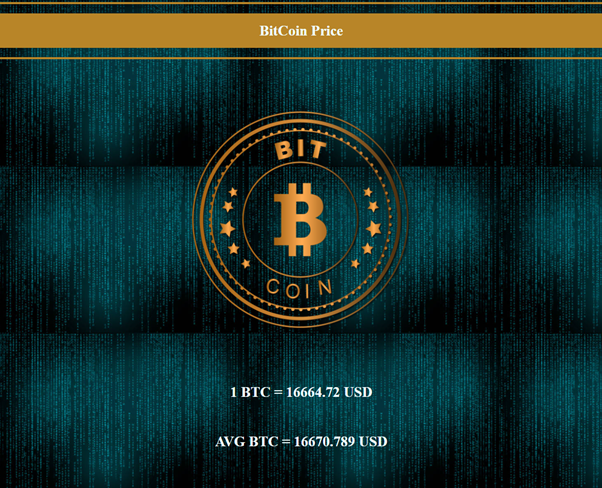
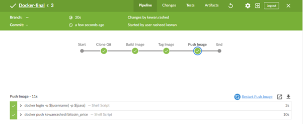
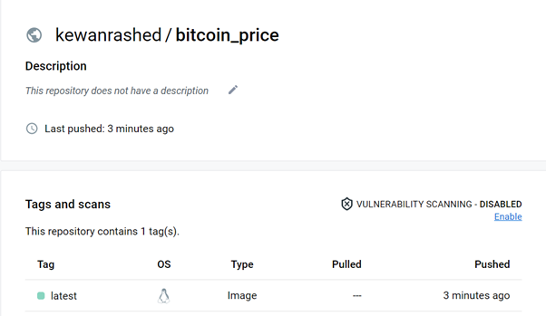

# Docker-Final-Task



Create a Python Web APP using FLASK that:
  -  Presents the Current BitCoin Price (LIVE)
  - Stores the price in a Redis Database
  - Presents the Average Price for the last 10 minutes (LIVE)
Dockerize the applications by Creating Dockerfile and docker-compose.yml file.

# Redit DataBase:

## Use cases:

### Real-time data store:

Redis' versatile in-memory data structures let you build data infrastructure for real-time applications requiring 
low latency and high-throughput.

### Caching & session storage

Redis' speed makes it ideal for caching database queries, complex computations, API calls, and session state.

### Streaming & messaging
The stream data type enables high-speed data ingestion, messaging, event sourcing, and notifications.

# Run Locally

## Clone the project


```bash
git clone https://github.com/RashedKewan/Docker-Final-Task.git
```

## Build the project
```bash
docker-compose build
docker-compose up
```

## Run by opening local host
```
http://localhost:5000/
```

## Stop the server
```bash
docker-compose down
```
 
# Website Home Page



# Jenkins pipeline Job
Used Jenkins to build and publish the application to Docker Hub. Create a token from Docker to push the 
image to Docker Hub and set the token in the Jenkins credentials.



# DockerHub 


